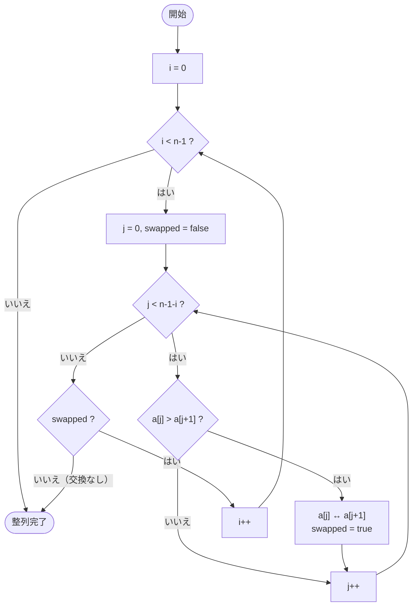
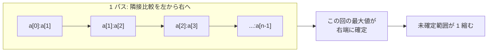

# バブルソート — データフロー可視化

## 概要

隣り合う 2 要素を比較し、順序が逆なら交換する。これを配列の端から繰り返すと、
大きい要素が泡（bubble）のように後ろへ上がっていく。

- 計算量: 平均・最悪 `O(n^2)`、最良 `O(n)`（最適化版・交換が無ければ早期終了）
- 安定ソート / in-place（追加メモリ `O(1)`）

## 制御フロー

## データフロー（1 パスで起きること）

## 可視化の勘所（Manim でアニメ化する点）

1. **比較中の 2 本のバー**をハイライト（色を変える）
2. **交換**はバーの位置を入れ替えるトランジション
3. **確定済み**の末尾要素は色を固定（もう動かない印）
4. **早期終了**: 1 パスで交換が無ければ「完了」表示

→ 実装は `scenes/bubble_sort.py`（Issue #2）。
